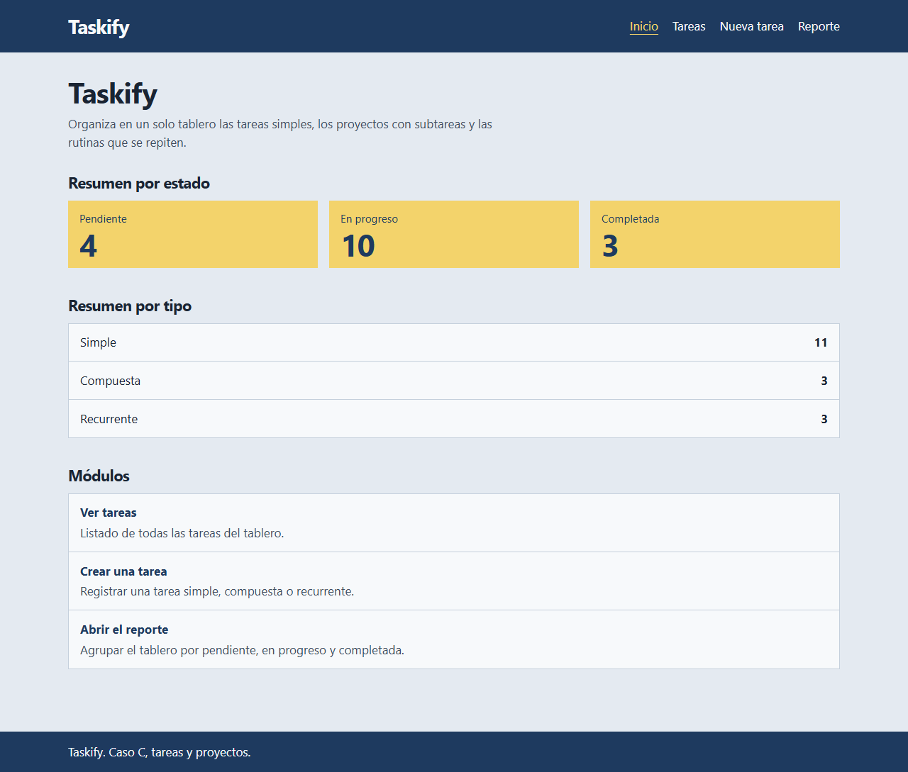
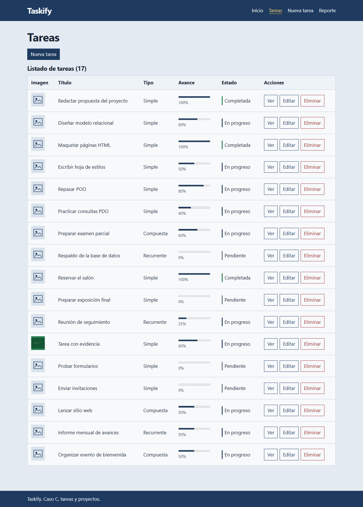
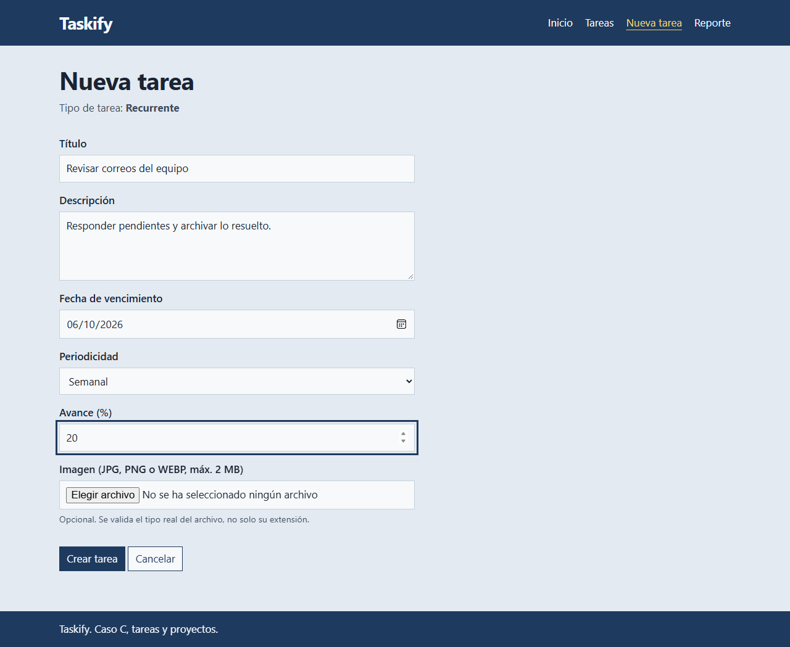
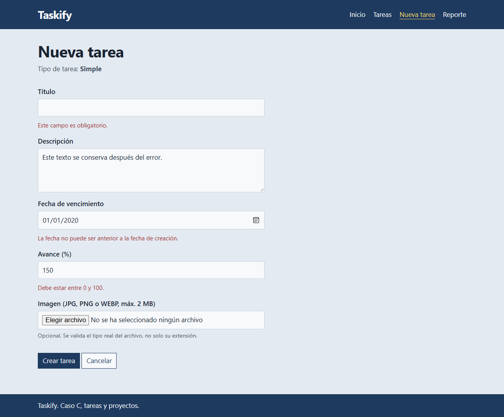
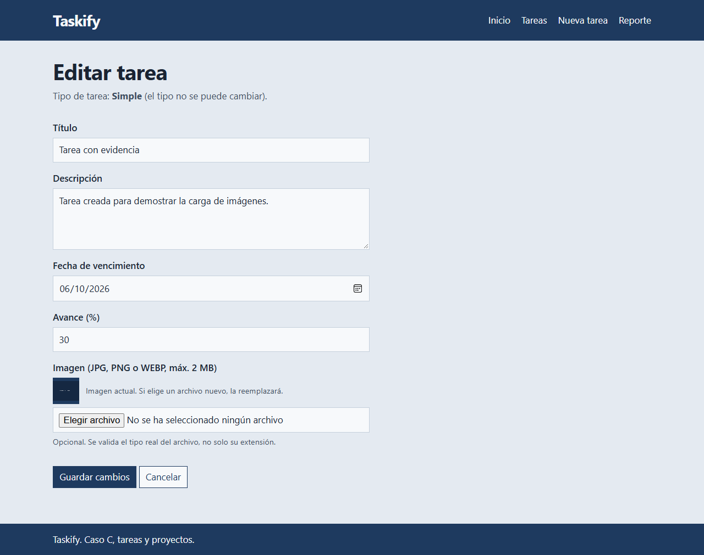
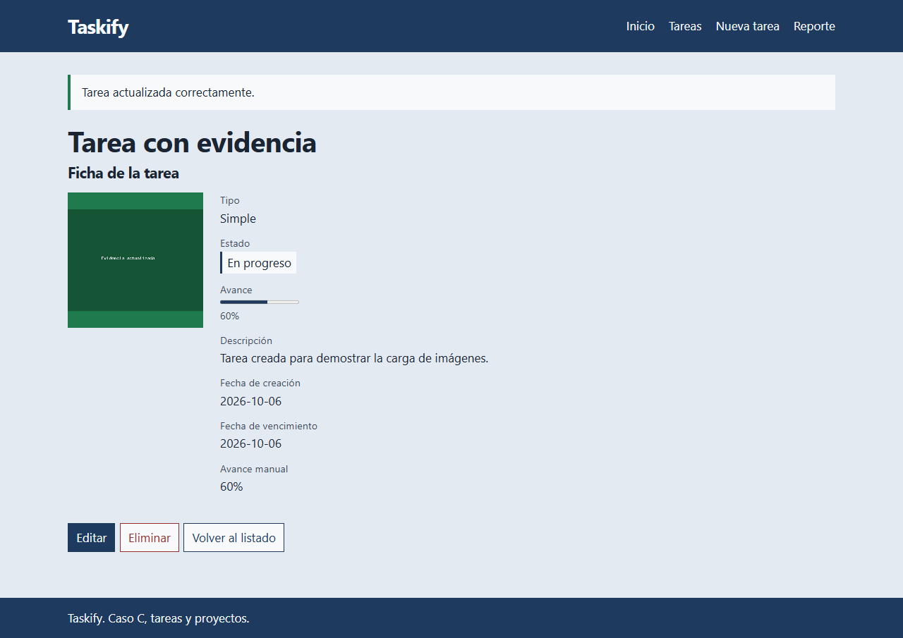
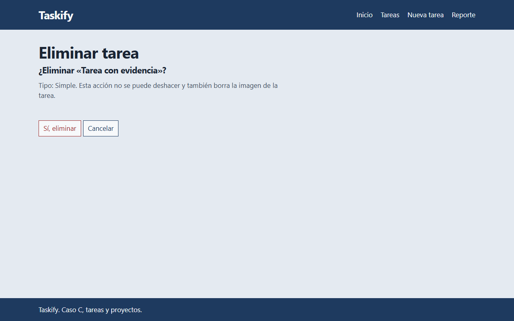
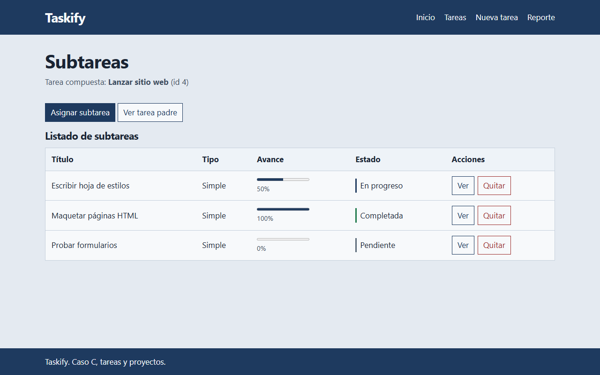
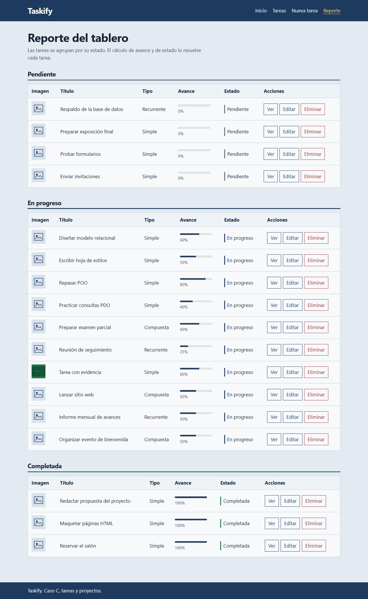
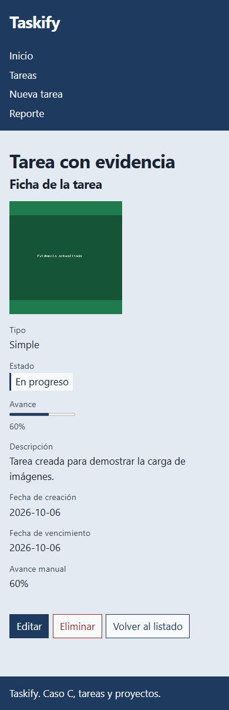

# Taskify

Gestor de tareas y proyectos en PHP 8.1+, desarrollado para el curso **Desarrollo de Páginas Web con Software Libre** (Universidad Católica de El Salvador).

- **Caso de estudio:** C · Tareas y proyectos (tarea simple, compuesta y recurrente).
- **Repositorio:** https://github.com/kevRodrguez/Taskify

## Fase 2: aplicación web

En la Fase 1 el proyecto modeló las tareas con Programación Orientada a Objetos y el patrón Composite, y se ejecutaba por consola (`php main.php`). En la Fase 2 el mismo modelo alimenta una aplicación web:

- Páginas HTML5 semánticas con una hoja de estilos propia (`public/css/estilos.css`), sin frameworks de PHP ni de CSS.
- Persistencia en MySQL/MariaDB con PDO y consultas preparadas, encapsulada en repositorios.
- CRUD completo de tareas y registro, listado y eliminación de subtareas (tabla relacionada).
- Formularios con validación en el navegador y en el servidor, token CSRF, mensajes flash y patrón Post/Redirect/Get.
- Imagen de evidencia por tarea: validación de tamaño y tipo real, nombre aleatorio, reemplazo y borrado.
- Reporte web del tablero, agrupado por estado, sin condicionales por tipo de tarea.

## Integrantes

| Nombre | Carnet |
|---|---|
| Ramos Castaneda, Jimmy Ernesto | 2023-RC-607 |
| Retana Hernández, Gustavo Adolfo | 2023-RH-601 |
| Rodríguez Posada, Kevin Fernando | 2023-RP-601 |
| Escobar Preza, Bryan Steven | 2023-EP-603 |
| Galán Gómez, Josué Andrés | 2023-GG-605 |

## Requisitos

- PHP 8.1 o superior, con las extensiones `pdo_mysql` y `fileinfo`.
- MySQL o MariaDB.
- [Composer](https://getcomposer.org/) (solo para el autoload PSR-4; no hay dependencias externas).

## Instalación

```bash
git clone https://github.com/kevRodrguez/Taskify.git
cd Taskify
composer install
cp config/config.example.php config/config.php   # editar usuario y clave de MySQL
mysql -u root -p < database/schema.sql
mysql -u root -p < database/seed.sql
php -S localhost:8000 -t public
```

Luego abrir http://localhost:8000.

- En Windows (cmd), el segundo paso de configuración es `copy config\config.example.php config\config.php`. Con XAMPP, el cliente está en `C:\xampp\mysql\bin\mysql.exe`.
- `schema.sql` crea la base `taskify` y borra las tablas si ya existen; `seed.sql` carga 16 tareas de prueba y 7 relaciones de subtarea.
- `config/config.php` contiene credenciales reales y no se sube al repositorio; solo se comparte `config/config.example.php`.
- También funciona con XAMPP o Laragon si el servidor apunta a la carpeta `public/`.

### Versión de consola (Fase 1)

```bash
composer dump-autoload
php main.php
```

### Pruebas

```bash
php tests/validador_test.php
php tests/gestor_imagenes_test.php
```

## Páginas

| Página | Ruta |
|---|---|
| Inicio / panel con resumen | `/` |
| Listado de tareas | `/tareas/index.php` |
| Registro (elige el tipo y muestra sus campos) | `/tareas/crear.php` |
| Edición con la imagen actual | `/tareas/editar.php?id=N` |
| Ficha de detalle | `/tareas/ver.php?id=N` |
| Confirmación de eliminación (se ejecuta por POST) | `/tareas/eliminar.php?id=N` |
| Subtareas de una tarea compuesta: listado y asignación | `/subtareas/index.php?tarea_id=N` |
| Reporte web del tablero | `/reportes/tablero.php` |

## Capturas

| Inicio | Listado |
|---|---|
|  |  |

| Registro | Errores por campo (validación del servidor) |
|---|---|
|  |  |

| Edición | Ficha de detalle |
|---|---|
|  |  |

| Confirmación de eliminación | Subtareas |
|---|---|
|  |  |

| Reporte del tablero | Vista en móvil |
|---|---|
|  |  |

El resto de las evidencias (carga de imágenes inválidas, validación W3C, historial de commits) está en [`docs/capturas/`](docs/capturas/).

## Estructura del proyecto

```
Taskify/
├── composer.json            autoload PSR-4: App\ → src/
├── main.php                 versión de consola (Fase 1)
├── config/
│   └── config.example.php   plantilla de configuración (config.php no se sube)
├── database/
│   ├── schema.sql           tablas tareas y subtareas, llaves y restricciones
│   └── seed.sql             datos de prueba
├── public/                  raíz del servidor web
│   ├── index.php            panel de inicio
│   ├── css/estilos.css      hoja de estilos única
│   ├── js/preview.js        vista previa de la imagen (apoyo, opcional)
│   ├── img/                 imagen por defecto
│   ├── uploads/             imágenes subidas (solo se versiona .gitkeep)
│   ├── tareas/              index, crear, guardar, editar, actualizar, ver, eliminar
│   ├── subtareas/           index, crear, guardar, eliminar
│   └── reportes/tablero.php
├── src/
│   ├── Contratos/           TareaInterface
│   ├── Estado/              EstadoTarea (enum)
│   ├── Tareas/              TareaBase, TareaSimple, TareaCompuesta, TareaRecurrente, Periodicidad, ReglasSubtarea
│   ├── Tablero/             Tablero
│   ├── Reportes/            ExportadorJson
│   ├── Database/            Conexion
│   ├── Repositories/        TareaRepositorio, SubtareaRepositorio
│   ├── Factories/           TareaFactory
│   ├── Services/            GestorImagenes
│   ├── Validation/          Validador, reglas de formulario, Csrf, Flash
│   ├── Exceptions/          DominioException, ConexionException, ImagenException
│   └── helpers.php          función e() para escapar la salida
├── views/
│   ├── layout/              encabezado.php, pie.php
│   └── partials/            tablas, formulario, imagen, mensajes
├── tests/                   pruebas del validador y del servicio de imágenes
└── docs/                    validaciones, imágenes, diagramas y capturas
```

Las carpetas de `src/` conservan los nombres de la Fase 1 (por responsabilidad del dominio): `Contratos/` equivale a `Interfaces/` y `Tareas/` a `Models/` en la estructura sugerida.

## Modelo de clases

```
TareaInterface
    ↑ implements
TareaBase (abstracta)
    ↑ extends
    ├── TareaSimple       avance manual
    ├── TareaCompuesta    promedia el avance de sus subtareas (Composite)
    └── TareaRecurrente   periodicidad y fecha vigente
```

`TareaFactory` es el único lugar que conoce las clases concretas. Repositorios, validación, vistas y reporte trabajan contra `TareaInterface`: cada tarea sabe persistirse (`aFila()`), reconstruirse (`desdeArray()`), describir sus campos de formulario (`camposEspecificos()`) y sus datos de ficha (`detalleEspecifico()`).

Diagramas de clases y entidad-relación: [`docs/diagramas.md`](docs/diagramas.md).

## Base de datos

Herencia de tabla única: la tabla `tareas` guarda los tres tipos con la columna `tipo`; `avance` y `periodicidad` admiten `NULL` cuando no aplican. La tabla `subtareas` relaciona `tareas` consigo misma (padre e hija) con dos llaves foráneas, `UNIQUE (padre, hija)` y `CHECK (padre <> hija)`.

## Documentación

- [`docs/validaciones.md`](docs/validaciones.md): reglas en cliente y servidor, y mensajes.
- [`docs/imagenes.md`](docs/imagenes.md): servicio `GestorImagenes` y pruebas.
- [`docs/diagramas.md`](docs/diagramas.md): diagramas de clases y entidad-relación.

El código usa las etiquetas `[ABSTRACCION]`, `[ENCAPSULAMIENTO]`, `[HERENCIA]`, `[POLIMORFISMO]`, `[INTERFAZ]`, `[COMPOSICION]`, `[CRUD-CREATE]`, `[CRUD-READ]`, `[CRUD-UPDATE]`, `[CRUD-DELETE]`, `[SEGURIDAD]`, `[VALIDACION]`, `[INYECCION-DEPENDENCIAS]`, `[FABRICA]` y `[PRG]` en el lugar donde se aplica cada concepto.

## Convenciones del equipo

- **Commits:** Conventional Commits (`feat`, `fix`, `refactor`, `style`, `docs`, `chore`) con ámbito.
- **Ramas:** `feature/<nombre>` → Pull Request hacia `dev` → `main`.
- **Código:** `declare(strict_types=1);`, namespaces bajo `App\`, mensajes de validación en español.
