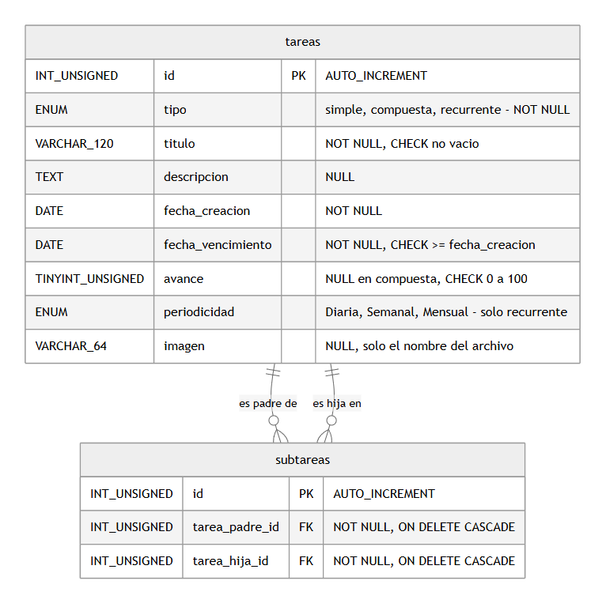
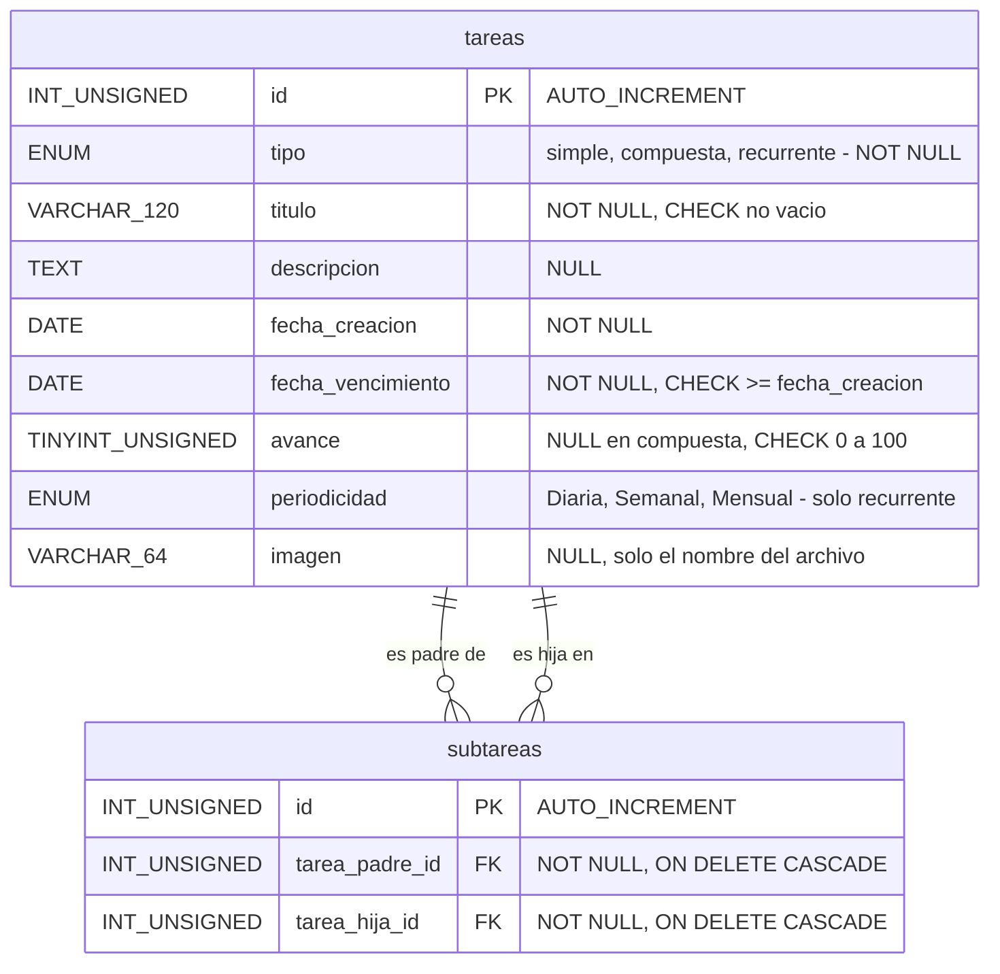
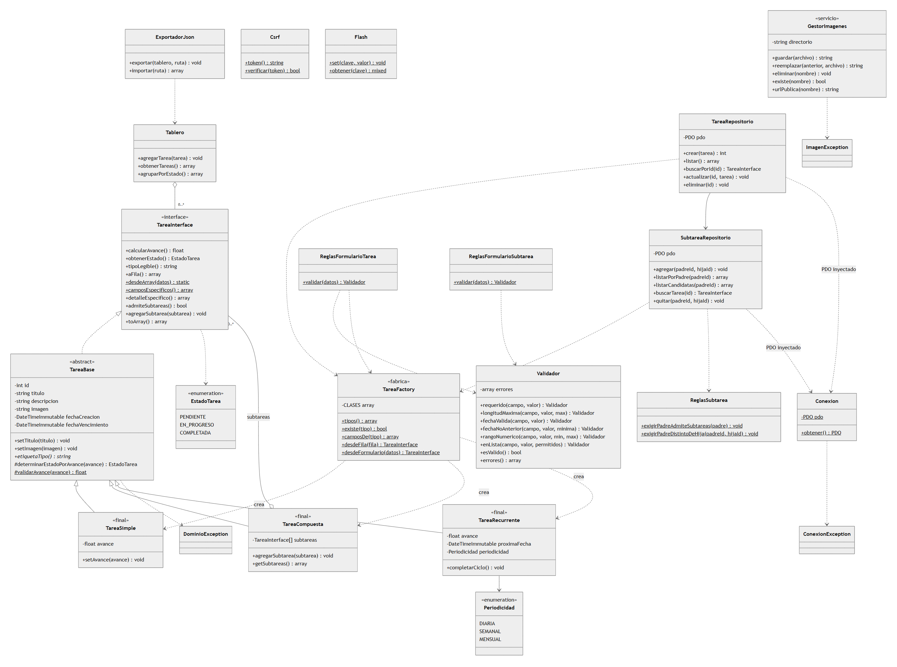
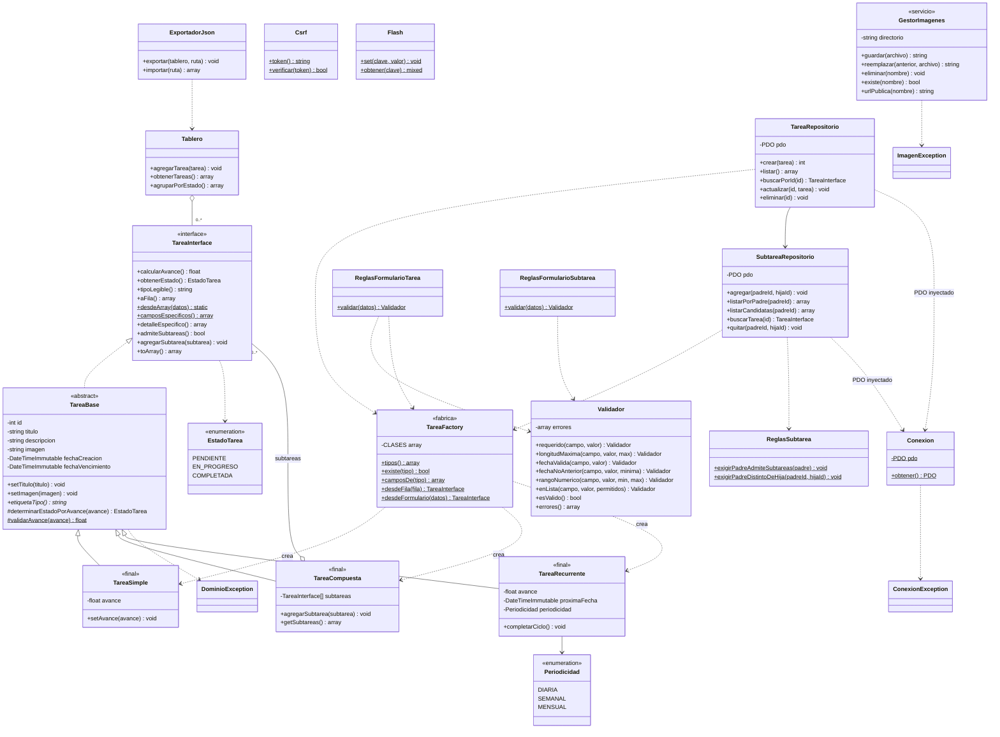

# Diagramas — Taskify Fase 2

Las imágenes se generan a partir de los bloques `mermaid` de este archivo (GitHub también los renderiza).

## Entidad-relación (fuente: `database/schema.sql`)

## Clases

