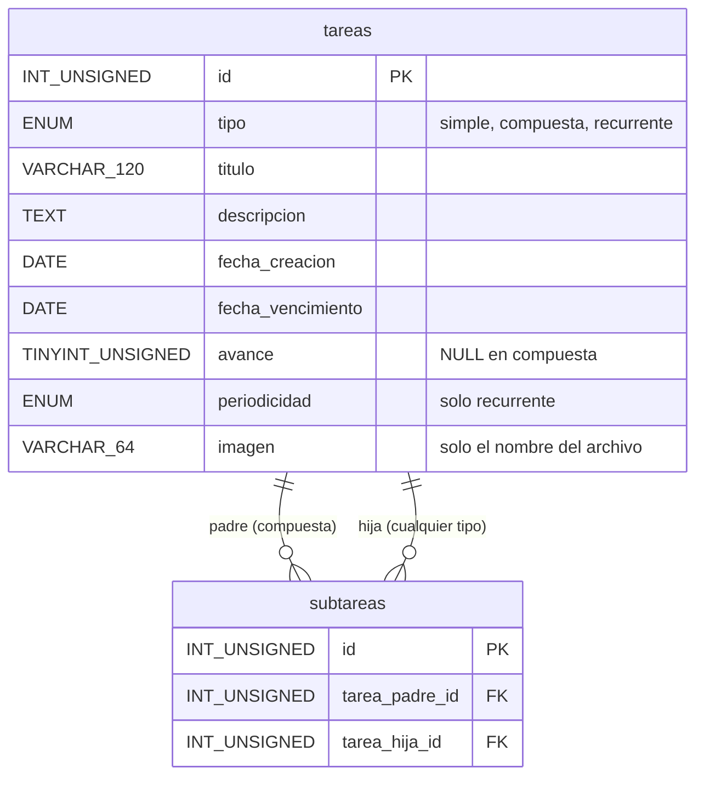
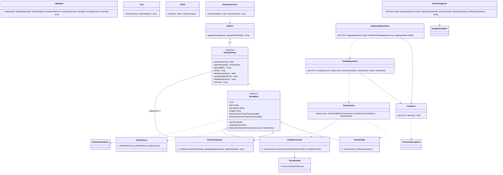

# Diagramas — Taskify Fase 2

GitHub renderiza los bloques `mermaid` de este archivo. Versiones editables en Lucid:

- Diagrama entidad-relación: https://lucid.app/lucidchart/f1aba68c-0bc0-4c68-812b-634985441960/edit
- Diagrama de clases: https://lucid.app/lucidchart/158a493d-6bca-4d64-8fe3-6c44347f3373/edit

## Entidad-relación (fuente: `database/schema.sql`)

## Clases

